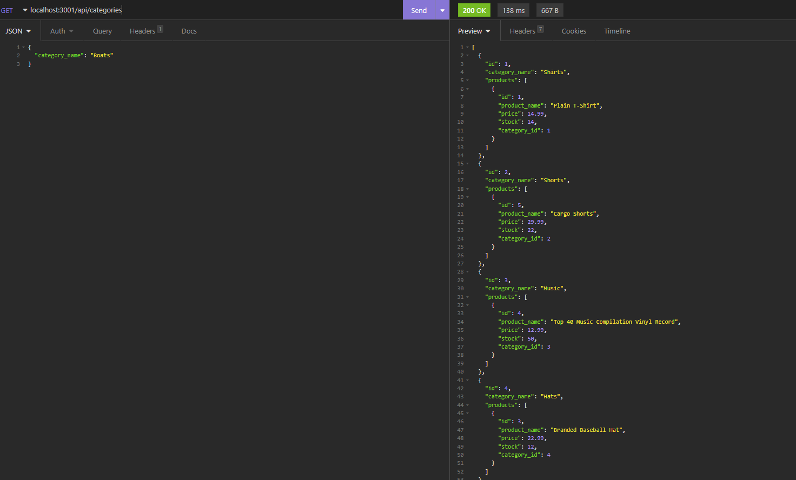
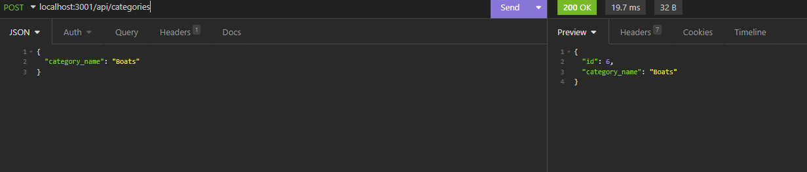
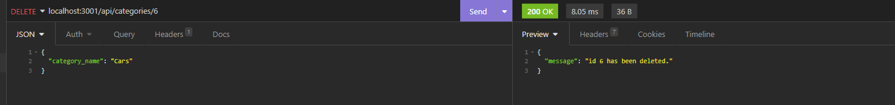

# e-commerce-back-end-challenge 

## Description 

This project is the backend logic and pathing for a small business to update products and associate the products with key words, or variables.
It allows the user to manage inventory, product names, and other various details within the database, through adding new items, updating and deleting.
As well as searching for each input by number.
 
## Table of Contents
 
- [Installation](#installation)
- [Usage](#usage)
- [Credits](#credits)
- [License](#license)

##  Installation 

TBD 

## Usage 

Walkthrough Video : https://app.castify.com/view/cd2a4e89-e8c7-4b09-a3b5-03ce02b35fa3

 

## Credits 

n/a 

## License 

MIT License 
Please refer to License in repository.  
 